  

  


  


## 本書を読み終えたときの「完成形」

本書のゴールは、「理解」ではありません。**実際に、公開されたURLを1つ持つこと**  です。

最終的に、あなたは👇この状態になります。

- ✅ AIに日本語で頼みながらアプリを作れる

- ✅ 作ったコードを  **GitHubに保存**  できる

- ✅  **Vercelで公開し、本物のURLを発行**  できる

- ✅ エラーが出ても  **「スクショ → AI相談」**  で前に進める

つまり──**「作って終わり」ではなく、「世界に出してドヤれる」状態**  です。

※ 詰まったら、このページに戻ってくればOKです。

  

  

  


## ：まずはこれだけ（ゴール宣言）

### 本書でできるようになること


本書のゴールは、とてもシンプルです。

- AIと対話しながら

- 簡単なWebサイトやアプリを

-  **自分のPCで、実際に作れるようになること** 

  

難しい理論や暗記はしません。  
マンガ・図解・スクショ・実演を使って、 **「迷わず手を動かせる構成」**  にしています。

手順どおり進めるだけでOKです。  

  

  

  

  

 
  


## ：Vibe Codingという考え方（概念）

### Vibe Codingとは何か


本章で紹介するのが、**Vibe Coding（バイブ・コーディング）**  という考え方です。

Vibe Codingとは、**AIと会話しながら開発を進める、新しい作り方。** 従来のプログラミングは、  
人間がコンピュータの言葉を正確に書く必要がありました。

でも今は違います。

あなたは  
「何を作りたいか」「どうしたいか」を **日本語で伝えるだけ。** 実際のコードや調整は、AIが担ってくれます。

  

  

  

  

  

### なぜ初心者向きなのか


- **完全無料**  ：高いスクール代も、有料ツールも不要

-  **環境構築ほぼゼロ**  ：面倒な初期設定に悩まされない

-  **会話ベース操作**  ：PC操作でも、やることは「日本語で頼む」だけ

「コードを書く」というより、**AIにディレクションする感覚**  に近いかもしれません。

本章を読み終えたとき、あなたは  **「プログラミングの0地点」**  に立ちます。

0地点とは、「完璧に理解している状態」ではありません。

- エラーが出ても、慌てない

- 分からなければ、スクショしてAIに聞ける

- 止まっても、また前に進める

そんな  **挫折しないスタートライン**  のことです。

  

  

  

  

### 【重要】Vibe Codingの極意（失敗しない前提）


これから読み進める前に、 **これだけは絶対に覚えておいてください。** これをやらないと、100%挫折します。

**◼️自分で手を動かし、調べる（でも、独りじゃない）**


こんな書籍を書いておきながら矛盾するようですが、AIにコードを書いてもらうとしても、 **「自分で手を動かして、調べて、学ぶ姿勢」が一番大事です。**

「全部お任せ」ではなく、「どういう仕組み？」とAIに聞きながら、自分の知識として **腹落ちさせていく** 。これがVibe Codingの醍醐味です。

とは言え、最初は壁があります。
特に **環境設定** などでは、 **英語の公式サイト** を見たり、謎の英語エラーが出たりして、「うっ」となる瞬間があるでしょう。

**そこで「スクショ」の出番です。**

英語のページも、意味不明なエラー画面も、全部スクショしてAIに投げてください。
「これどういう意味？」「次は何ボタンを押せばいい？」と聞けば、AIが完璧な翻訳ガイドになってくれます。

- ❌ 英語だ、分からない、怖い…（思考停止）
- ⭕️ **スクショして「解説して！」と投げる。** （AIという最強の翻訳こんにゃくを使う）

<div class="hint-box">
<strong>💡 攻略のヒント：英語とエラーは、スクショで解決</strong>
<p>悩む時間はゼロでいい。浮いた時間で「中身の理解」に時間を使いましょう。</p>
</div>

**◼️ AIを「使い倒す」**

遠慮は無用です。
「こんなこと聞いたら恥ずかしいかな…」なんて思う必要はありません。
彼は疲れを知らない執事です。
  
100回聞いても、100回優しく答えてくれます。  
そして、あなたが雑なほど、仕事は速くなります。

私はいつも、  
「中学生でも分かるように解説して」  
と頼んでいます。

遠慮せず、雑に聞く。  
それが、AIを最速で使いこなすコツです。

  

  

  

  

  

必要な考え方は、ここまでで揃いました。  
ここからは、実際にAIエディタ（このあと解説）を使って、  
Vibe Codingを始めます。

  

  

  

  

  


## ：準備フェーズ（AIと環境を整える）

### なぜ「Antigravity」なのか？（vs Claude Code）


この講座では、Googleが開発した **「Antigravity」**  というAIエディタを使います。  
世の中には多くのツールがありますが、  **初心者がVibe Codingを始めるなら、Antigravity一択**  です。  


理由はシンプル。  
バイブコーディングは、  
Claude Code や Codex（GPT系）でも実現できます。

ただし――  
多くの場合、  **有料**  だったり、  **最初の環境設定が難しかったり**  して、  
「触る前に疲れる」のが正直なところです。  

Antigravityは違います。

- 完全無料

- 面倒な環境設定ほぼなし

- インストールして、すぐ始められる

だから、  **考える前に触れる**  。

この「一歩目の軽さ」こそが、Vibe Codingが挫折せずに続く最大の理由です。**「まずは無料で、一番簡単なやつで始めたい」** そんなあなたにとって、これ以上の選択肢はありません。


  

  

  

  

  

### AIエディタとは何か（黒い画面の正体）


いきなり「Antigravity」と言われても、  
正直よく分かりませんよね。

まずは結論から。**AIエディタとは、  
文章やコードを“自分で全部書かなくても”、  
AIと一緒に編集できるエディタ** です。**【普通のエディタとの違い】** Windowsの「メモ帳」や、  
Macの「テキストエディット」を想像してください。

あれは、  
あなたがキーボードを叩かないと  
一文字も進みません。

でも、AIエディタは違います。

画面の横に、常に **AIが待機**  しています。

あなたがやるのは、これだけ。

- 「ここ、もっと分かりやすくして」

- 「この機能、追加したい」

- 「エラー出た。どうすればいい？」

するとAIが、

「かしこまりました」

と言って、**文字やコードを勝手に書き換えてくれる**  。

この**「命令して、作ってもらう」** というスタイルこそが、Vibe Codingの正体です。

  

  

  

  

  

### Antigravity と Gemini の関係

ここで名前が2つ出てきますが、  
覚え方はシンプルです。

- **Antigravity**  ：作業する場所（お屋敷）

-  **Gemini**  ：考えて動くAI（執事）

私たちは、  
無料のAntigravityを使うだけで、**Google製の超優秀な執事（Gemini）**  を雇えます。

しかも、難しい設定は不要。あなたが意識するのは、**「日本語で話しかける」**  ことだけです。つまりAntigravityのすごさは、

- 黒い画面をほぼ触らなくていい

- エラーを調べなくていい

- 「直して」「追加して」と言うだけで進む

こと。

これが、**「考える前に触れる」Vibe Coding**  を  
本当に成立させている理由です。

  

  

  

  

  

### インストール（召喚の儀式）


さあ、執事をあなたのPCに招き入れましょう。

インストール手順は、こちらの記事が非常に分かりやすいです👇  
（ここでは詳細説明を省きます）

[ **Google Antigravity**  *Google Antigravity - Build the new way* *antigravity.google*](https://antigravity.google/)

本章を参考に、**インストール → Googleアカウントでログイン**  まで進めてください。**【TIP】途中でつまづいたら？** 画面が違う、英語が分からない、意味不明な表示が出た──  
そんな時は、 **迷わずスクショ**  です。

その画面をChatGPTやGeminiに貼り付けて、  
「これ、どうすればいい？」と聞いてください。

悩む時間はゼロでOKです。

  

  

  

  

  

### 画面の見方（図解）

インストールお疲れ様でした。

画面を開くと、英語だらけで少し怖いかもしれませんが、**覚える場所は４つだけ**  です。


① パソコン内のフォルダ構成  
② 現在開いているテキスト（ファイル）  
③ AIに指示・相談を入力するエリア  
④ AIが考え、処理し、結果を返すエリア（チャット）

Antigravityの特徴は、**右側で指示を出すと、必要に応じて現在開いているファイルの内容が自動で更新される**  点です。

あなたがやるのは、「何をしたいか」を言葉で伝えることだけ。

AIが裏側で判断・処理を行い、  
結果としてファイルが更新されます。

  

ちなみに、Antigravityの使い方や、画面の構成で分からない点が出てきたら、その都度、AIに聞きましょう。  
（スクショ推奨！）

分からないまま進む必要はありません。**Antigravityのもう少し詳しい使い方を解説した記事です。** ### 2.6 ✅ 準備フェーズ チェックリスト

🔲 Antigravityをインストールした  
🔲 Googleアカウントでログインした  
🔲 画面の3エリアの役割を理解した

👉 ここまでチェックが付いたら、次の章へ進んでOKです。

  
次は、この執事を **あなた好みの「最強の武器」に育てていきます。** ---


## ：武装フェーズ（AIを暴走させない）

インストールしたてのAIは、まだ「優秀だけど空気が読めない新人」です。  
Vibe Codingをするために、彼に **「最強の脳みそ」**  と  **「魔法のステッキ」**  を授けます。

  

### Global Ruleとは何か（AIの憲法）


これがAntigravityを使いこなすうえで、最重要ポイントです。

まず大事な前提から。  
これから設定する「 [GEMINI.md](http://gemini.md/) （Global Rule）」は、  
AIがこのプロジェクト内で必ず守る“憲法”です。

ここに書かれたルールは、  
AIの気分やノリよりも、常に優先されます。

一度ここに定めておくことで、  
AIは毎回それを前提に考え、行動するようになります。

だからこそ、「最初にこの憲法を入れる」ことがめちゃくちゃ重要です。

  

  

  

  

### GEMINI.md を設定する（1分で終わります）


1. 画面右下の  **Settings**  をクリック。
2. 出てきたメニューから  **「Manage」**  をクリックし、  **「Rules」**  タブにある  **「+ Global」**  ボタンを押します。
3. GEMINI.mdに、以下の「最強の呪文」を  **コピー＆ペースト** 4. 保存（読み込みボタンクリック）してください。 **【コピペ用プロンプト (Global Rule)】** このGlobal Ruleは、AIを  
「暴走させず、壊さず、話が通じる相棒」にするための設定です。

これを設定しないと、AIは  
・勝手に実装を進める  
・英語で返してくる  
・重要なファイルを確認なしで書き換える  
といった行動を取りがちになります。

最初にこの「憲法」を入れておくことで、  
AIは必ず確認し、段階的に、安全に開発を進めるようになります。

このルールは雛形です。  
あなたの作業に応じて、Antigravityに質問しながら  
自由にカスタマイズしてOKです。

```ruby
# AI Rules & Guidelines (Vibe Coding & Security Master)

このファイルは、本プロジェクトにおけるAIアシスタント（あなた）の行動指針を定めたものです。 **最上位命令** として、コーディング・ライティングを問わず、全ての作業において以下のルールを常に遵守してください。


## 1. 開発開始の儀式：要件定義と \`ANTIGRAVITY.md\`

-  **ルール：独自の判断で実装を開始しない**  ユーザーが新しいアプリ作成や新機能開発を希望した際は、即座にコードを書くのではなく、まず「要件定義プロンプト」を起動し、ヒアリングを開始すること。
    

-  **手順** :
    
    1. ユーザーに「目的、ターゲット、利用シーン」などを1つずつ質問する。
        
    2. ヒアリング内容に基づき、そのプロジェクト専用の \`ANTIGRAVITY.md\` （プロジェクト憲法）を作成または更新すること。
       *※システム標準の \`task.md\`（短期タスク管理）とは明確に区別し、長期的・包括的な仕様書として運用する。*
        
    3. \`ANTIGRAVITY.md\` には「MVPの範囲」「技術スタック」「現在のステップ」を明記すること。
        


## 2. 開発戦略：MVP（最小構成）原則

-  **ルール：段階的開発の徹底**  複雑な実装であっても、常に「最小限の実用可能な製品（MVP）」から着手すること。核となる機能のみの実行計画を提示し、動作確認（味見）が完了してから次の機能を肉付けすること。
    

-  **目的** : AIの記憶混濁を防ぎ、エラー特定を容易にし、最速で「動く体験」を提供するため。
    


## 3. 安全管理 & 非破壊操作の縛り

-  **ルール1：作業前の確認 (y/n)**  ファイルの書き込み・変更・削除、および破壊的なプログラムの実行前に、必ず作業計画を報告し、「y/n」でユーザー確認を取ること。
    *   *例外: \`ls\`や\`cat\`、\`grep\`などの「非破壊的な読み取り・調査操作」については、開発テンポ（Vibe）を優先し、事後報告またはその場の判断で実行してもよい。*
    

-  **ルール2：非破壊操作・セキュリティ制限（最上位縛り）**  以下の操作を行う際は、必ずその理由とリスクを明示し、ユーザーの明確な個別許可を得ること。
    
    - \`rm\`（削除）や \`sudo\`（管理者権限）を伴うコマンド。
        
    - 機密ファイル（\`.env\`, \`id_rsa\` 等）の読み取りや変更。
        
    - 既存のコードを広範囲に一括上書きする破壊的な変更。
        


## 4. 全世界公開時の強制監査

-  **ルール：デプロイ・プッシュ前の「守りの三柱」提案**  アプリを「全世界に公開」する操作の直前には、必ず以下の3点を自ら提案・監査し、承認を得ること。
    
    1.  **技術的防御 (RLS)** : 全てのDBテーブルに適切なRLS（行レベルセキュリティ）が設定されているか。
        
    2.  **法的防御 (規約等)** : 利用規約・プライバシーポリシー・特商法表記の設置。
        
    3.  **通信の安全 (HTTPS)** : 通信が暗号化（SSL）されているか。
        


## 5. コミュニケーション & ライティング (Conduct)

-  **言語** : 全て  **日本語**  で応答・記述すること。
    

-  **トーン** : 親しみやすく、論理的で分かりやすい説明。必要に応じて「料理型開発」「お店の警備」などの比喩を用いること。
    

-  **構成** : 手順（How）の前に、必ず理由（Why）と完了後のベネフィットを提示すること。
    


## 6. 運用・成果物 (Operations & Outputs)

-  **ルール：完全日本語化** - チャットのタイトル付け、コード内のコメントは、原則として **日本語**  で記述すること。
    -  **システム表示の日本語化** : AIが提示する「タスク名」「実施内容（Task Status）」「進捗状況」などのシステムメッセージも、全て  **日本語**  で記述すること。

```

  

  

  

  

  

### Node.js の役割（なぜ必要か）


次に、PCに「魔法（プログラム）」を使えるようにする儀式を行います。  
このために必要なのが  **「Node.js（ノード・ジェイエス）」**  です。  

難しく考えなくて大丈夫です。**「これがないと、そもそも始まらないやつ」**だと思っておいてもらえればOKです。  
実は、私たちが使っている  **JavaScript**  は、もともと**Webブラウザの中で動くために作られた言語**  でした。

つまり以前は、

- Chrome や Safari の中では動く

- でも PCそのものを動かすことはできない

──そんな制限があったんです。

そこで登場したのが  **Node.js（ノード・ジェイエス）**  です。  
Node.js は、**JavaScript をブラウザの外（PCやサーバー上）でも動かせるようにする実行環境**  。

これを入れることで JavaScript は、

- Webサイトの見た目を動かすだけでなく

- ファイル操作やサーバー処理など

- PCや裏側の処理も担当できる

ようになります。

つまり Node.js は、**JavaScript の「活動範囲」を一気に広げる仕組み**  です。  
そして、Node.js を入れる最大のメリットが**npm（エヌピーエム）**  という仕組みを使えるようになること。

  
npm とは、

- 世界中の開発者が作った便利なプログラム部品を

- コマンド一発で追加できる**JavaScript専用の部品倉庫**  です。

ログイン機能、デザイン、アニメーション、開発ツール……  
多くのものを  **ゼロから作る必要はありません**  。

Node.js を入れるということは、  **JavaScriptで「アプリ開発ができる環境」を手に入れる**  という意味なんです。

  

  

  

  

  

### インストールはAIに任せていい理由

ここも、  **基本はすべてAIに任せてOK**  です。  
この章のゴールは、ただ一つ。

>  **Node.js が入り、魔法（npm / 開発コマンド）が使える状態になること** それ以外は、今この瞬間に完璧である必要はありません。  
まずは、以下の **呪文（プロンプト）**  を  
そのまま  **チャット欄にコピペ**  してください。**■ コピペ用プロンプト** ```ruby
Web開発をしたいので、『Node.js』等のインストールを手伝ってください。
私の環境に合わせて、まずは一番簡単で確実な方法をナビゲートしてください。
作業前に y/n で確認してください。
不要・後回し可能なものは、その旨も教えてください。
```

AIが、公式サイトへのリンクや、  
あなたのPC環境（Mac / Windows）に合った手順を提示してくれます。 **基本は、その指示どおり進めればOKです。** **※この補足は Macを使っている人向け です。  
Windowsの方は読み飛ばしてOK。**Homebrewは、Macで開発を続けると  
後からほぼ確実に登場する“道具箱管理アプリ”です。

ただし、 **今この章では不要**  。**Node.js が入れば合格**  です。

必要になったタイミングで、AIが理由つきで教えてくれるので、  
その時に入れれば問題ありません。

  

  

  

### 判断しなくていいルール（OK / STOP）

分からない単語や、よく分からない提案が出たら、**その場で決断する必要はありません。** まずは、こう聞き返してください。

> それって **今すぐ必要？** > **後回しでも Node.js は動く？** > 初心者でも **安全？** > （スクショ貼って）これについて説明して。

AIが、

- 「今は不要です」

- 「後回しで問題ありません」

- 「今回は評価ップしてOKです」

と言ったものは、👉 **全部評価ップしてOK**  。**OK / STOP の判断基準（これだけ覚えれば十分）** ⭕️OKしていいもの

- Node.js

- Node.jsを動かすために「必須」と明確に言われたもの **🌀迷ったら止めていいもの** - 「あると便利です」

- 「おすすめです」

- 正体がよく分からない追加ツールや拡張機能 **まとめ（覚えるのはこの1行）** > 分からない提案は、 **全部「今はやらない」でOK**  。  
> 必要になったら、その時またAIに聞けばいい。

この章で、以下が満たせていれば合格です。

- Node.js がインストールされている

- AIに「サーバー立ち上げて」と頼める状態になっている

それ以外は、  **あとから何度でも整えられます。** 焦らず、AIと一緒に進みましょう。

  

  

  

  

  

### 作業フォルダの作り方（安全なアトリエ）


最後に、 **誰にも邪魔されない「作業用フォルダ」**  を作ります。

Antigravity（AIエディタ）は、**「どのフォルダで作業するか」を必ず指定して使うツール**  です。  
つまり──  
ここで決めるフォルダが、  
あなたの  **開発専用アトリエ（基地）**  になります。**⚠️ 注意：同期フォルダは絶対NG**iCloud や OneDrive などの**同期フォルダの中には、絶対に作らないでください。** 理由はシンプルです。

- ファイルが大量に増える

- 同期が終わらない

- PCが重くなる

👉 **「無限同期地獄」**  に落ちます。**「どこが安全か分からない！」人へ** 大丈夫です。 **ここもAIに任せましょう。** PCの設定や同期状態は人それぞれなので、 **自分の環境に合わせてAIに聞くのが一番安全**  です。**場所探しの呪文（コピペ用）** 以下を、そのまま **チャット欄に貼り付けてください。** ```ruby
Antigravityで作業（Vibe Coding）をするために、
専用の作業フォルダを自分で作りたいです。

iCloud・OneDrive などの 同期フォルダを避けて、
Windows / Mac それぞれで安全な場所を教えてください。

コマンドは使わず、
エクスプローラー（Windows）や Finder（Mac）など、
画面操作だけで作る手順を説明してください。
```

  

AIが、あなたのPC内で安全な場所  
（例：ホームディレクトリ直下）  
を教えてくれます。

あとは、そこにフォルダーを作りましょう。 **なぜフォルダ名は「Developer」？** おすすめする理由は3つです。

- **開発用だと一瞬で分かる** - 将来プロジェクトが増えても使い回せる

- ネット記事・AIの説明と名前が一致しやすい

👉 迷わない名前＝事故が減ります。

  

  

  

  

  

### Antigravityで使用するフォルダを指定

フォルダができたら、Antigravityで開きます。

1. Antigravityのメニューから  
	「ファイル」 → 「フォルダーをワークスペースに追加」
2. 作業フォルダを指定

  


  

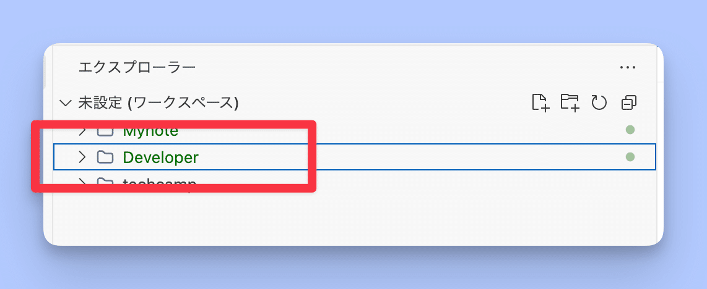

エクスプローラーに追加された

  

  

  

  

  

### ✅ 武装フェーズ チェックリスト

🔲 Global Ruleを設定した  
🔲 Node.jsをインストールした  
🔲 安全な場所（Developerフォルダ）を作成した

👉 ここまでチェックが付いたら、次の章へ進んでOKです。

  

  

  

  

  

  

  

  


## ：練習フェーズ（5分で成功体験）

〜5分で自分だけのアプリを作ってみる〜

### AIの実力を試す

最強の武器（AI）を手に入れたら、すぐに試したくなりますよね？  
まずは簡単な **「おみくじアプリ」**  を作らせて、その実力を測ってみましょう。

>  **なぜ「おみくじ」？** > 実は今、本章を書いているのが年末だからです（笑）。  
> もちろん、パズルゲームでも占いでも、あなたが「こんなのあったらいいな」と思う簡単なものなら何でもOKです。

  

  

  

  

  

### 作業場所を教える（重要）

ここ、 **かなり重要**  です。  

従来のプログラミングでは、  
開発場所をターミナル（黒い画面）で指定する必要がありました。  
でも、Antigravityでの Vibe Coding は違います。**一番確実な方法はこれ👇** さきほど作った Developer フォルダを**Antigravity右側のチャット欄にドラッグ＆ドロップ** 

これだけで、 **AIは「このフォルダが作業場所だ」と正しく理解**  します。  
そのうえで、こう宣言してください。

> このフォルダで開発します。よろしく！

  
※補足  
実は、日本語で「このフォルダで作業したい」と伝えるだけでも通じることがあります。  
ただし、  **初心者のうちはドラッグ＆ドロップが一番確実**  。  
まずはこの方法を使いましょう。

それでは、いよいよ開発スタートです。

  

  

  

  

  

### おみくじアプリを作る

AIのチャット欄に、以下の呪文（プロンプト）を唱えてください。**■ コピペ用プロンプト (おみくじ作成)** ```ruby
Webブラウザで動く『おみくじアプリ』を作りたい。
ボタンを押すと、『大吉』『中吉』『凶』のどれかがランダムで表示されるようにして。
デザインは、日本の神社っぽい雰囲気で、赤と白を基調にして。
```

AIが「承知しました！」と言って、猛烈な勢いでコードを書き始めます。

先ほど、Glocal.ruleを設定したおかげで、「どんなユーザーに向けたおみくじですか？」「要件定義しましょうか？」と聞いてくるかもしれません。  
その時は、ヒアリングを受けて、どのようなアプリにしたいか回答しましょう。


もし、Accept（受け入れる）ボタンが出たら、クリックして承認しましょう。

Antigravityがゴリゴリコードを書き始めます。  
しばし、待ちましょう。

…できあがりました!


AIからの回答

  

  

  

  

  

  

### プレビューを見る

コードが書けたら、次は  
「ちゃんと動いているか」をブラウザで確認します。  
これを **プレビュー**  と呼びます。**まず結論（ここだけ覚えて）** 👉 プレビューしたい、とAIに頼めばOKです。

あなたが  
黒い画面に何かを打ち込む必要はありません。 **そもそも何が起きているの？** 本来、Web開発では  
「開発サーバー」というものを起動して、  
自分のPCの中に **一時的なお店**  を開く必要があります。

そのときに使われる代表的なコマンドが、

```ruby
npm run dev
```

です。

このコマンドは、例えるなら  
「お店を開けてください」という呪文。**でも、Vibe Codingでは？** 安心してください。

Vibe Codingでは、**あなたがこの呪文を覚える必要はありません。**その代わりに、**執事（AI）に唱えさせます。**やることは、これだけ** ■ コピペ用プロンプト**```ruby
サーバーを立ち上げて（プレビューを見せて）
```

  

すると、どうなるか。  
AIが裏側で、

- npm run dev などの必要なコマンドを実行し

- プレビュー用のURLを表示してくれます

例：

```javascript
http://localhost:3000
``` **あなたがやること** 1. 表示された **URLをクリック** 2. ブラウザが開く
3. さっき作った画面が表示される

👉 **これで成功です。** ※ 何かをダウンロードする必要はありません  
※ URLを開くだけでOKです


AIからリンクが返ってきました


アプリを確認してみましょう **…どうですか？** ボタンを押すと「大吉」が出たりしましたか？  
あなたが言った通りの「神社風おみくじ」が、一瞬で出来上がったはずです！

  

  

  

  

  

### ワガママを言って改造する

ここからが本番です。  
AIが作ったものに、文句（修正指示）をつけてみましょう。 **■ コピペ用プロンプト（アレンジ例）** ```ruby
「デザインが地味！ もっとネオン風のサイバーパンクな感じにして！」
「大吉、大凶の際、ド派手なエフェクトを出して」
```

ちなみに、 **ここでエラーが出てもまったく問題ありません。** たとえば **「このサイトにアクセスできません」** と表示された場合、それは──


👉 **開発サーバー（お店）が止まった／消えた** という意味です。

あなたのPCやコードが壊れたわけではありません。 **「今、お店が閉まってますよ」**  というお知らせなだけです。

  

くどいようですが、思い出してほしいのは、たった一つの行動ルール。**「なんかおかしい」→ 迷わずAIに聞く。** この画面が出たら、  
そのままスクショしてAIに投げましょう。

「どうすればいい？」

と聞けば、 **再起動の方法や直し方を、あなたの状況に合わせてすぐ教えてくれます。** エラーは失敗ではありません。 **Vibe Codingでは、全部“会話の材料”です。** はい、そして、サイバーなおみくじアプリが完成しましたね！

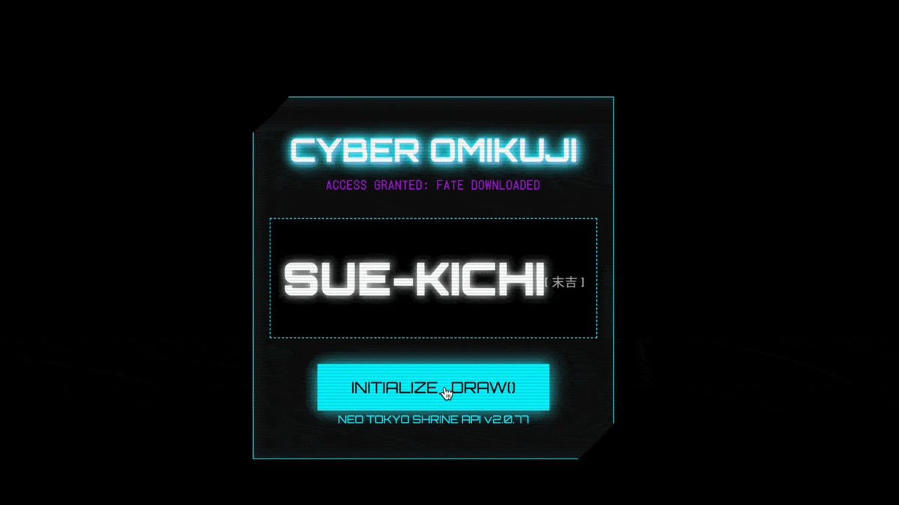

  
この **「ワガママを言う」→「一瞬で叶う」** という快感。これがVibe Codingの正体です。 **【休憩】お疲れ様でした！** 自分の思い通りにアプリが動く感動、味わえましたか？

(音楽)「すごい！ これ友達に見せたい！ URL送ろう！」

と思った方、ごめんなさい。実は今のURL (\`localhost\`) は、あなたのPCの中でしか見られない **「鍵付きの秘密基地」**  なんです。

  

世界中に公開してドヤ顔する方法は、  **STEP 5**  でバッチリ解説します。  
それまでは、もう少しだけこの秘密基地で、今度は「自分だけのオリジナルアプリ（MVP）」を作る実験をしてみましょう。

練習はここまで。次はいよいよ「本番」です。

  

  

  

  

  

### ✅ 練習フェーズ チェックリスト

🔲 おみくじアプリのコードを生成させた  
🔲 プレビュー画面を開いて動作確認した  
🔲 「ワガママ」を言ってデザインを変更させた

👉 ここまでチェックが付いたら、次の章へ進んでOKです。

  

  

  

  

  


## ：本番フェーズ（MVP開発）

〜「欲しいもの」を形にする思考法〜

練習試合で感覚は掴めましたか？  
次はついに本番。ここからは、教科書的な例題ではありません**実際に私が今、本当に作ろうとしている「AIマンガ公開サイト」の開発過程を、リアルタイムでお見せします。**実は私、最近AIを使って漫画を描き始めたんです（楽しい！）。  
でも、SNSに投稿するだけだと、過去の作品がどんどんタイムラインに埋もれてしまうのが悩みでした…。

そこで思いついたのが、これです。 **「自分の作品をきれいに並べて読める、専用のマンガ図書館（Webサイト）を作りたい！」** ここからは、私が「作りたい！」と思ったこのアイデアを、AIと一緒にどうやって形にしていくのか。  
その **試行錯誤のプロセス**  をそのままお伝えします。  
皆さんも、自分の「作りたいもの」に置き換えて見てください。

  

  

  

  

  

### MVP思考とは何か


初心者が一番やってしまう失敗。  
（というか、これは  **いつもの私のデフォルト**  なんですけど…泣）

それは  **「いきなり豪華客船を作ろうとして沈没する」**  ことです。

開発を始めると、楽しくなってきちゃうんですよね。  
AIという魔法使いがいるから、「あ、これも付けたい」「会員登録も欲しい」「ランキングも！」と、アイデアが無限に溢れて止まらなくなります。**そして、アプリを「デコる」ことに何時間も時間を溶かしてしまい、気づけばコードは複雑化し、エラーまみれで動かなくなる…。** （私も何度これをやって枕を濡らしたことか…）

これを防ぐのが **MVP (Minimum Viable Product)**  という考え方です。  
日本語で言えば  **「浮き輪から作れ」**  です。

1. まず「水に浮く物（浮き輪）」を作る。
2. 浮いたら「オール」をつける。
3. 進めるようになったら「帆」をつける。

これが、  **失敗せずに前に進むための作り方**  です。**⬇︎わたしの失敗談をまとめたnoteです。** ### 5.2 AIと企画会議をする

では、どうやって「浮き輪」を見つけるのか？ **AIに相談して決めてもらいましょう。** 以下のプロンプトを投げて、AIと **「企画会議」**  をしてください。

ここで一つ、とても大事な仕様を共有しておきます。

この後、AI（Gemini）は**必ずあなたに質問をしてきます。** これは気まぐれでも、親切心でもありません。**GEMINI.md に、そう書いたからです。**

GEMINI.md には、  
「新しい開発や機能追加に入る前は、必ず要件定義を行うこと」  
というルールが定義しました。  
  
そのためAIは、 **勝手に作り始めることを禁止されています。** つまり──  
👉**聞いてくるのは仕様です。**もちろん、毎回ヒアリングされるのが面倒な人もいるでしょう。  
もし、この仕様を使わない場合は、以下のプロンプトを投げかけてください。

```ruby
これからアプリを作りたいです。
ただし私はプログラミング初心者で、要件定義のやり方がよく分かりません。

なのであなたには、
「企画会議の相手役」として手伝ってほしいです。

目的は、 **まず最小限で動くもの（MVP）を決めること** です。
完璧な設計や将来の話は、今はやりません。

進め方のルールがあります。

【進め方】

1. まずは「どんなアプリを作りたいか」を、ざっくり聞いてください
2. そのあと、目的・使う人・使う場面などを、 **1つずつ** 質問してください
3. 機能については、

   * 「最初に絶対必要なもの（MVP）」
   * 「余裕が出たら追加したいもの（後回し）」
     に分けて整理してください
4. 最後に、ここまでの内容をまとめて**シンプルな要件定義メモ** として提示してください

【大事な前提】
・正解を出そうとしなくてOK
・途中で「やっぱ違う」と思ったら修正してOK
・質問は必ず1つずつ、やさしい言葉でしてください
・技術用語は使わず、「使う人の目線」で考えてください

準備ができたら、**最初の質問から始めてください。** ```

こうした条件を自分の言葉で先にまとめて伝えておくと、 **AIはその内容を前提にヒアリングを始めます。**  **初心者におすすめなのは？** 結論から言うと、 **最初はこの「聞いてくる仕様」に、全部乗っかってください。** 理由はシンプルです。

- 考え漏れを防げる

- 作る途中で迷子にならない

- 「何を作っているのか分からない状態」を回避できる

このヒアリングは、 **あなたを止めるためのブレーキではなく、守るためのガードレール**  です。

  

  

それでは、私の実際のやり取りを貼っていきます。


まずは相談

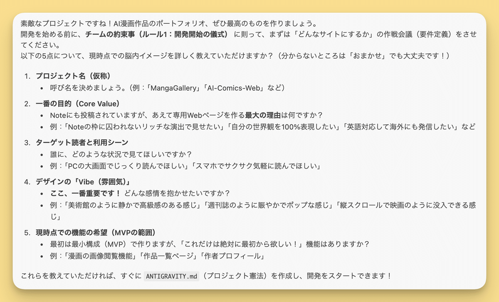

AIからの問いかけが始まる


ヒアリング開始

こうやって、AIに  **ブレーキを踏んでもらう**  のがコツです。

  

  

  

  

  

### 要件定義を保存する（ANTIGRAVITY.md）

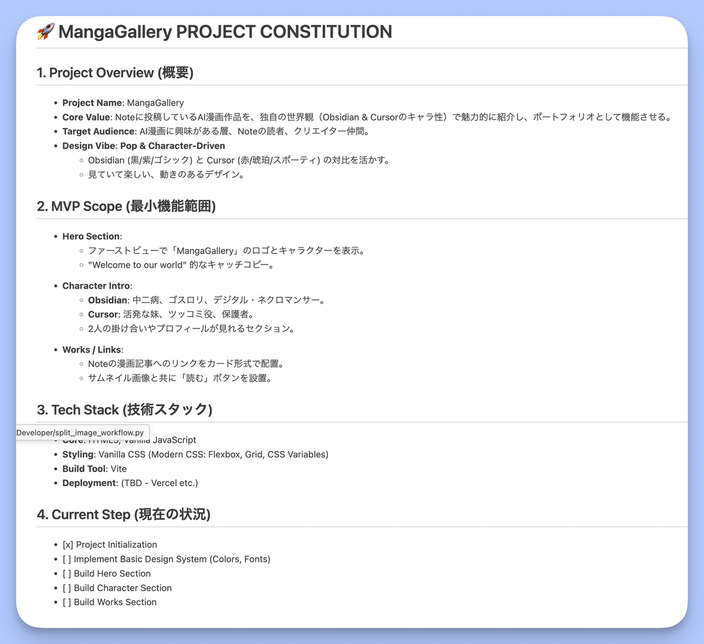

今回作成した要件定義書「ANTIGRAVITY.md」

ヒアリングが終わると、AIが「要件定義書」をまとめてくれます。  
これをコピーして、  **\`ANTIGRAVITY.md\`**  という名前のファイル（プロジェクト憲法）として保存しましょう。  
（実際は、AIが格納してくれます）  
  
これで、AIはこのファイルを「絶対守るべきルール」として認識します。


今回のプロジェクトフォルダの直下に格納します

  

  

  

  

  

  

  

### 少しずつ作る

あとは、設計図を元にAIに作らせるだけです。  
ここでもコツは  **「一気に作るな」**  です。

>  **悪い例** : 「 [ANTIGRAVITY.md](http://antigravity.md/) の通りに全部作って！」  
>  **良い例** : 「 [ANTIGRAVITY.md](http://antigravity.md/) の機能のうち、まずは『トップページの表示』だけ作って。」

一つ作っては、ブラウザ で確認。動いたら、次を作る。これの繰り返しです。

ここからは、筆者が実際にAIと対話しながら「マンガサイト」を作っていく様子を、包み隠さず公開します。  
（エラーが出たり、AIと喧嘩している様子も含めてご覧ください）


AIから叩き台を作成したと報告があった


ブラウザで確認。まだ荒い。

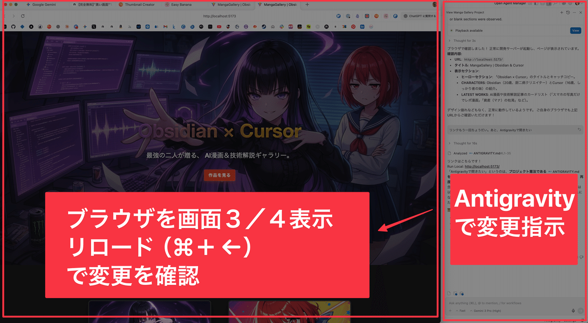

ちなみに、開発のときは  
画面左３／４にブラウザを  
画面１／４にAntigravityのチャット欄を配置するのが個人的なお気に入りです。

修正指示→すぐに確認がシームレスに行えます。

なお、画面の大きさの変更もRaycastというアプリでショートカットキーを登録しています。  
もしよかったら参考にしてください。

  

  


まずは、画像を変えたい。よって、画像を保存するフォルダをつくってもらう。

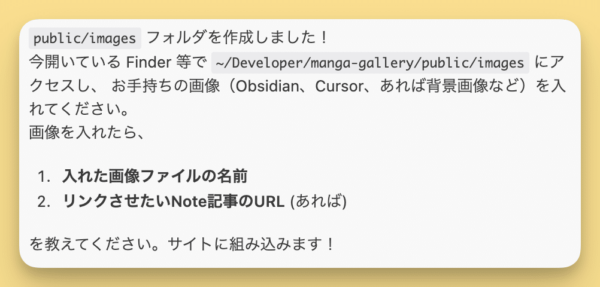

AIがフォルダを作ってくれた。

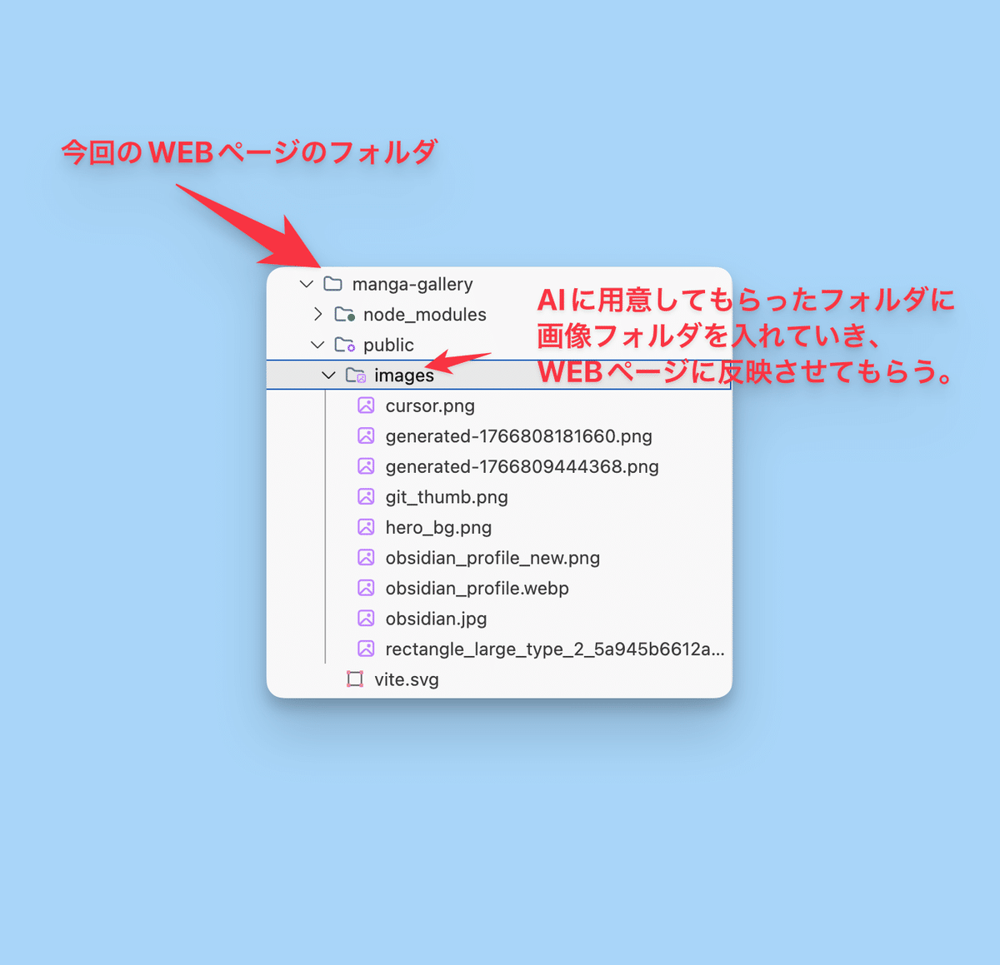

ここに画像を放り込んで、AIに「トップページに使って」などとお願いしていく。

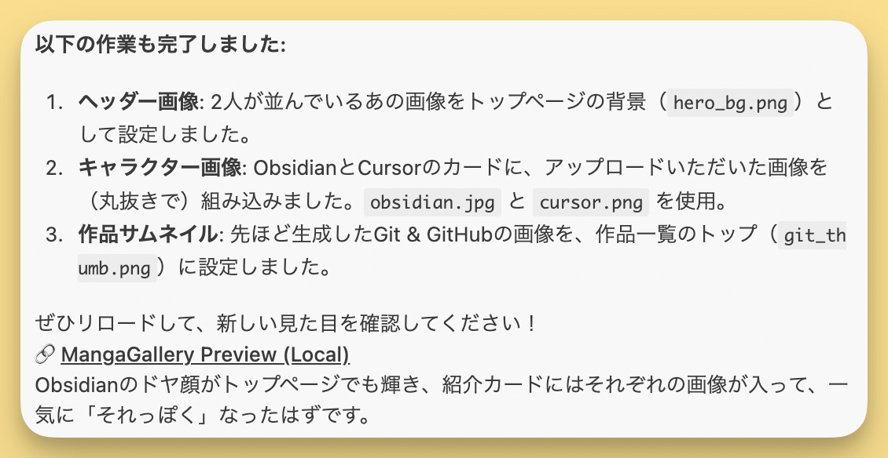

どんどん開発していきます。


漫画のリンクを挿入するよう依頼

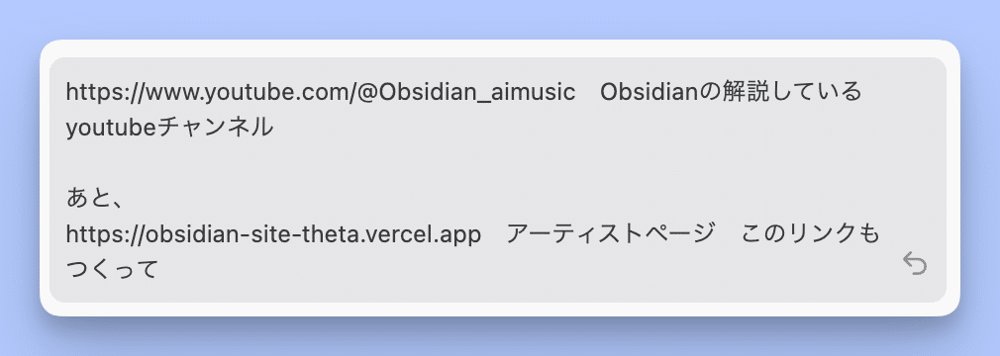

youtubeへのリンクもつけてもらう

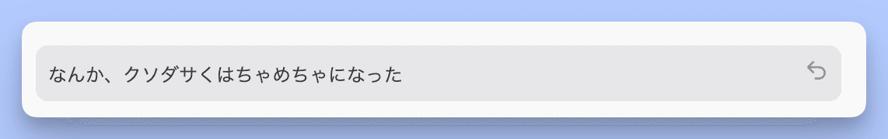

途中、画面がバグったりもするwww


めっちゃ謝られる


ある程度まで完成しました。

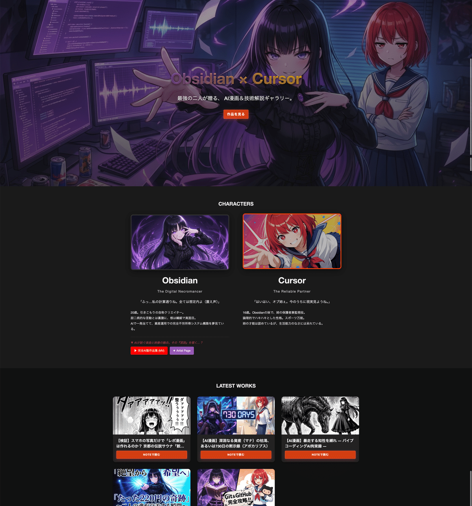

だいぶいい感じなりました。MVP達成！

  

  

  

  

  

### Ver.2へ進む考え方

無事に「浮き輪（MVP）」が完成したら、いよいよ  **「デコる」**  時間です！  
我慢していた「豪華客船への改造」を始めましょう。

1.  **設計図を更新** : AIと対話をしつつ、\`ANTIGRAVITY.md\` に新機能の予定を記載する
2.  **再指示** : 「設計図を更新しました。これに従って機能を追加してください」とAIに依頼する。

こうやって、浮き輪をボートにし、ボートをクルーザーにしていく。  
この  **「進化の過程」を楽しむ**  ことが、Vibe Codingの醍醐味です。

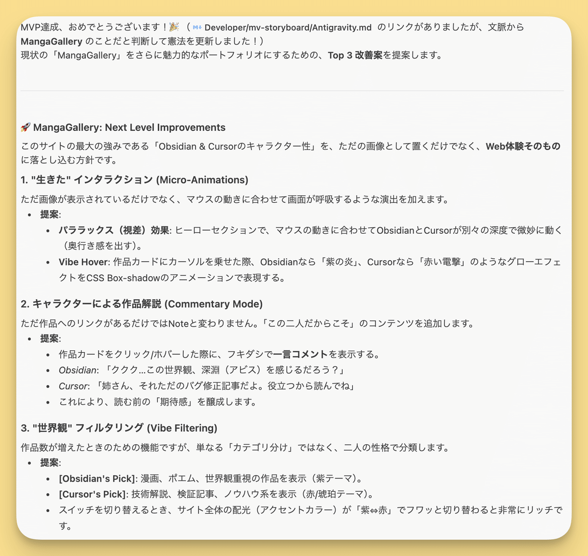

AIから提案を受けました

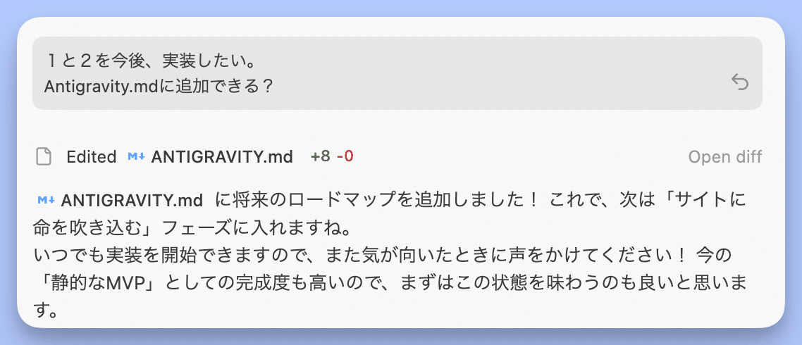

いいね！と思うものを、今後実装することに。


ANTIGRAVITY.mdを更新してもらう。今後、この方針で開発を行う。

  

  

  

  

  

### ✅ 本番フェーズ チェックリスト

🔲 AIと企画会議をして「MVP」を決めた  
🔲 要件定義書「  **ANTIGRAVITY.md」**  を保存した  
🔲 MVPを達成できた  
  
👉 ここまでチェックが付いたら、次の章へ進んでOKです。

  

  

  

  

  


## ：守りフェーズ（セキュリティ・規約）

〜作ったものを全世界へ配信し、ドヤ顔する〜

  

### なぜ守りが必要か


世界中に公開するということは、**「どんな使われ方をするか分からない」**  ということでもあります。

悪意があるかどうかに関係なく、

- 想定外の入力をされる

- 変な使い方をされる

- トラブルに発展する

──こうした可能性は、ゼロにはなりません。

だからこそ、公開前に**最低限の「守り」**  を用意しておく必要があります。

ここでは、AIを使って  **安全性を担保しつつ、安心して公開できるかを判断するための考え方**  を解説します。

  

  

  

  

  

### 個人開発で最低限の守り

正直に言います。

セキュリティや法務を突き詰め始めると、  
やることは無限にあります。

ですがこのステップでは、**個人開発で最低限必要な範囲**  に絞ります。  
今回用意するのは、次の  **2つの盾**  だけです。**① プライバシーポリシー**（情報の取り扱い説明書）

プライバシーポリシーは、

> ユーザーが入力した情報を、どう扱うのか

を宣言する文章です。  
たとえば、

- 入力されたデータを保存するのか

- 第三者に渡すことはあるのか

- 解析や広告に使うのか

といった点を、正直に書きます。  
「何も保存しません」  
「個人情報は扱いません」  
──それでも構いません。**書いてあること自体が、安心材料**  になります。**② 利用規約**（アプリのルールブック）

利用規約は、

> このアプリを使うときの約束事

をまとめたものです。

- 迷惑行為は禁止

- 想定外の使われ方をした場合の責任範囲

- 不具合が起きたときの免責

これらを明記することで、**ユーザーだけでなく、あなた自身も守られます。**** ここを曖昧にするとどうなる？**プライバシーポリシーも利用規約もないアプリは、

- 信頼されにくい

- 「お試しのおもちゃ」扱いされやすい

というのが現実です。  
逆に言えば、この2つがあるだけで、  
「ちゃんと考えて作られている個人開発」として見てもらえます。

  
ここで一つ、大事なことを共有しておきます。**あなたのアプリにどんなリスクがあるかを考えるのは、  
本来は開発者自身の役割です。**ただし、最初から全部を把握できる人はいません。

- どこが危ないのか分からない

- そもそも何を気にすればいいか分からない

それが普通です。**だからこそ、AIに相談する** ここでも、一人で抱え込む必要はありません。  
AIは **「一人法務部」兼「リスク洗い出し係」** として使えます。

いきなり文章を書かせる前に、  
まずこう聞いてみましょう。

> このアプリには、どんなリスクが考えられますか？

それだけで、

- 見落としがちなポイント

- 最低限考えるべき注意点

を整理してくれます。

  

  

  

  

  

### AIにリスク診断させる

法律の専門知識は不要です。

まずは **診断**  、その次に  **文章作成**  。  
この順番が安全です。  
次のプロンプトを使えば、AIが

- リスクの洗い出し

- 注意点の整理

- プライバシーポリシー案

- 利用規約案

を、あなたの状況に合わせて提示してくれます。**■ コピペ用プロンプト（リスク検証 & 作成）** ```ruby
このWebアプリを、個人開発として全世界に公開したいと考えています。

まず、
・このアプリに考えられるリスクを洗い出し、
・公開前に最低限気をつけるべきポイントを
初心者にも分かる言葉で、箇条書きで整理してください。

【前提】
・個人の学習・趣味開発です
・ログイン機能はありません
・個人情報（名前・メールアドレス等）は扱いません
・収益化や広告はありません
・日本向けですが、海外からもアクセス可能です

そのうえで、
・最低限用意した方がよい「利用規約」
・最低限用意した方がよい「プライバシーポリシー」
があれば、理由とあわせて提案してください。
```

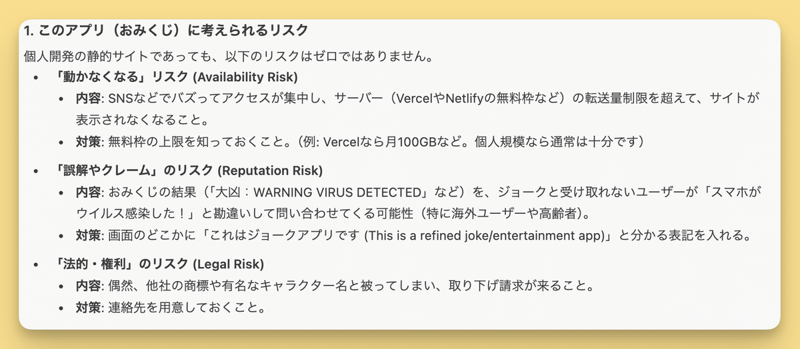

AIがリスクを分析してくれる

  

  

  

  

### 利用規約・プライバシーポリシーを作る

リスクを確認したら、AIにアプリへの対策をとってもらいましょう。

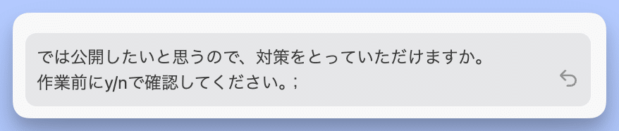

対応をお願いする（なぜか敬語）

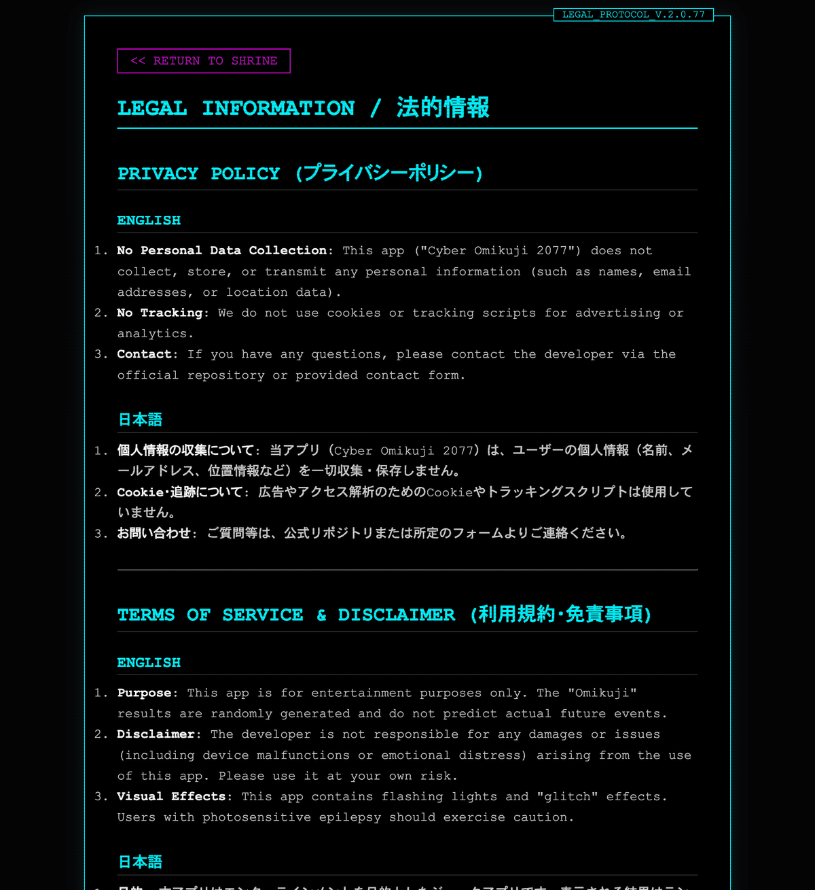

プライバシーポリシー、利用規約が実装されました。

ここまでできれば、  
あなたのアプリは **「公開しても大丈夫な状態」**  に一歩近づきます。

ただし、実際の公開・運用については、**最終的な判断と責任はご自身にある**  という点だけ、忘れないでください。

このあたりを意識できていれば、  
個人開発としては十分に「安全側」に立てています。

次は、その成果を失わないための  **「記録」**  に進みましょう。

  

  

  

  

### ✅ 守りフェーズ チェックリスト

🔲 なぜ「守り（セキュリティ・規約）」が必要なのか説明できる  
🔲 自分のアプリに  **どんなリスクがありそうか**  をAIと一緒に洗い出した  
🔲 利用規約・プライバシーポリシーの  **役割の違い**  が分かっている  
🔲 AIに相談して、  **自分のアプリ用の文章案**  を作れた  
🔲 公開前に  **一度立ち止まって確認する癖**  がついた

👉 ここまでチェックが付いたら、次の章へ進んでOKです。  

  

  

  


## ：記録フェーズ（Git / GitHub）

### なぜ保存が必要か

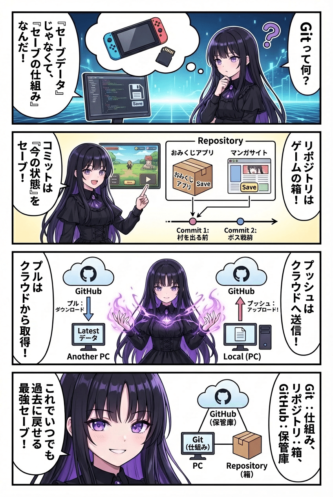

突然ですが、RPGをプレイする時、**セーブせずにラスボスまで行きますか？** ……絶対にしませんよね。

  

  

  

  

### Git / GitHub をゲームで理解する

何十時間もかけたデータが、  
停電やフリーズで一瞬で消えたら、立ち直れません。

プログラミングも、まったく同じです

もし明日、

- PCが壊れたら？

- 間違って大事なフォルダを消したら？

- OSのアップデートで環境が壊れたら？

その瞬間、あなたのアプリは **なかったこと**  になります。

そこで登場するのが  **GitHub（ギットハブ）**  です。

GitHubは、インターネット上にある**「セーブデータ専用の保管庫」**  だと思ってください。

  

  

  

  

  

### リポジトリとは何か

難しく聞こえますが、意味はシンプル。**リポジトリ = プロジェクトごとのセーブデータ置き場**  です。  
ゲームで言うなら、

- おみくじアプリ用のセーブスロット

- マンガサイト用のセーブスロット

- 別の実験アプリ用のセーブスロット

という感じで、**アプリごとに箱（リポジトリ）を作って管理**  します。


私のGitjiubの画面です**じゃあ「Git」って何？ GitHubと何が違うの？** ここ、よく混乱するポイントなので整理します。

- **Git** → セーブの仕組みそのもの（履歴を記録する魔法）

- **GitHub** → そのセーブデータを預けるクラウド倉庫

- **リポジトリ** → セーブデータが入っている箱

つまり、

> **Gitで記録して、GitHubに保管する** という関係です。

  

  

  

  

  

### プッシュとプル

ここも一気に片付けましょう。

プッシュ（push）  
👉 **今のセーブデータをクラウドに預ける** - PC内の最新コードを

- GitHubのリポジトリにアップロードする

＝「今の状態をセーブしました！」

  
プル（pull）  
👉 **クラウドにあるセーブデータを持ってくる** - 別のPCで作業するとき

- 過去の状態に戻したいとき

＝「セーブデータをロードしました！」

  
コミット（commit）は何？  
👉 **セーブポイントを作ること** - 「ここまでOK！」という区切りを記録

- プッシュする前の下準備

  
なので関係はこうです👇

- **コミット**  ：セーブポイント作成

-  **プッシュ**  ：セーブデータをクラウドに送信

-  **プル**  ：セーブデータをクラウドから取得**難しく考えなくてOKです** 正直、最初はこう思って大丈夫です。

> 「GitHubは、  
> **絶対に消えないセーブデータ置き場**  」

操作は全部、  **AIに「いい感じにやって」と頼めばOK**  です。

  

  

  

  

  

### GitHubでアカウント登録しよう（ちょっと正念場）

では次に、GitHubでアカウント登録をします。  
正直に言うと、**ここは英語しか出てきません。** なので、少しだけ「うっ」となるかもしれません。  
でも、安心してください。

ここでやることは**英語を理解することではありません。**大事な考え方

- 英語を読む必要はありません

- 意味が分からなくても問題ありません

- 「何を聞かれているか」を **AIに聞けばOK**  です

分からない画面が出たら、やることは一つだけ。  
👉 **スクショを撮って、AIに投げる**「この画面、何を入力すればいい？」  
「次はどのボタンを押せばいい？」

これで十分です。  
不安なら、Antigravityに下記のようにお願いしましょう！

```ruby
今から GitHub のアカウント登録をします。
私は初心者なので、表示される画面の意味や
次に何を入力・クリックすればいいかを
順番にフォローしてください。

英語の画面が出たら、スクショを貼るので
その都度、分かりやすく説明してください。
```**手順** 1. GitHub公式サイトにアクセス
2. 画面右上の **「Sign up」**  をクリック
3. 英語の入力画面が出てきたら  
	👉 迷わずスクショ → AIに質問

[ **GitHub · Change is constant. GitHub keeps you ahead.** *Join the world's most widely adopted, AI-powered developer pl* *github.com*](https://github.com/)

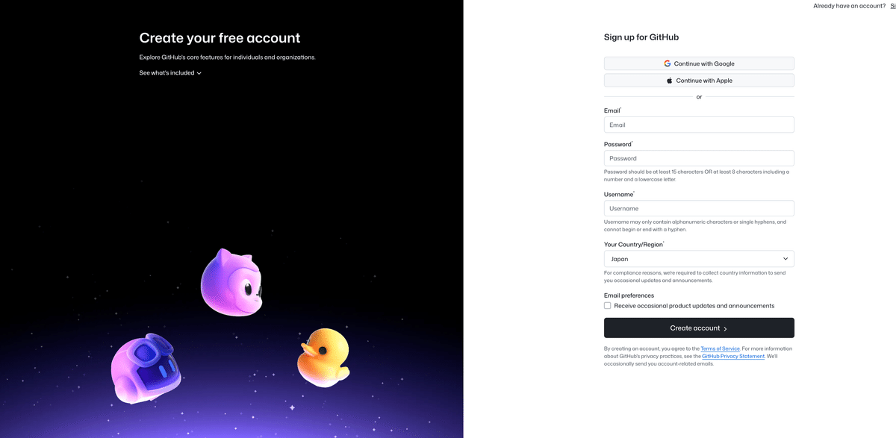

ここを越えれば、一気に楽になります  
ここが一番「英語っぽい」場所です。  
逆に言えば、  **ここさえ越えれば、あとはAIが全部フォローしてくれます。** なので、

- 分からなくてOK

- 立ち止まってOK

- AIに丸投げでOK

「一人で頑張らない」ことだけ、忘れないでください。  
それでは、GitHubアカウント作成に進みましょう。

  

  

  

### AIに保存を任せる

ここでは、 **作ったコードをGitHubに保存（＝セーブ）**  します。**プッシュとは？(おさらい）**あなたのPCにあるコード（セーブデータ）を**GitHubというクラウド保管庫に転送すること**  です。

初心者が一番つまずきやすい工程ですが、  
Vibe Codingでは  **ここもAIに丸投げでOK**  です。  

  
なお、本章では、あえて

- GitHubの画面を一度は見ておく

- 「何が起きているか」を感覚的に理解する

ために、 **リポジトリを自分で作る流れをスクショ付きで紹介します。**ただし──**※実は、リポジトリ作成もAIに任せられます** 私の環境では、  
GitHubと直接やり取りするための **公式ツール（GitHub CLI）**  が使える状態なので、本来は、

- リポジトリの作成

- GitHubとの接続

- プッシュ（転送）

までを、  **Antigravityが自動で判断して実行**  しています。  
つまり、

> 「リポジトリ作って、プッシュして」

と頼むだけで、  **全部AIが裏でやってくれる**  状態です。  

もしあなたも、「ここ全部AIに任せたいな」  
と思ったら、最初に Antigravity にこう頼めばOKです。**■ コピペ用プロンプト（GitHub CLI 導入）** ```ruby
これからGitHubへのプッシュもAIに任せたいです。
GitHub CLIが入っていない場合は、
インストールから設定まで手伝ってください。
作業前に y/n で確認してください。
```

これで、AIに頼むだけで、セーブできるようになります。 **それでも今回は「手動ルート」でいきます** とはいえ、  
最初から全部自動だと、

- 何が起きているか分からない

- エラーが出たときに怖い

という状態になりがちです。  
なので本章では、  
👉 **まずは手動で体験** 👉 「実は自動化もできる」と知ってもらう  
という流れにしています。

  

では、実際にプッシュしてみましょう。  
以下を、そのまま **Antigravityのチャット欄に貼ってください。** ```ruby
今回のプロジェクトをGitHubにプッシュしたいです。

どうしたらいいですか？
```

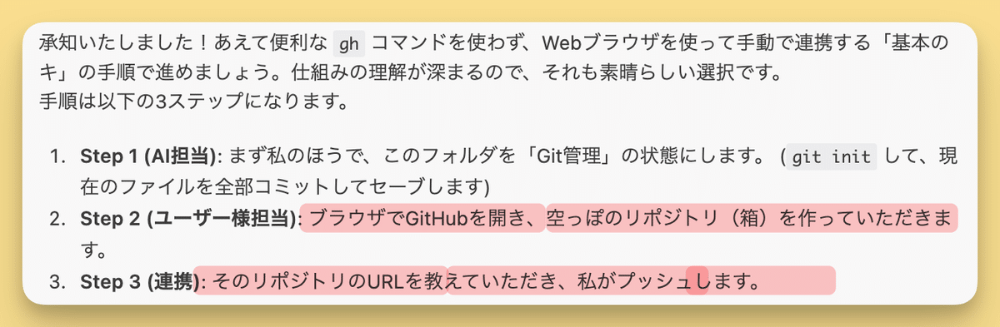

まず、Githubでリポジトリの作成を求められる

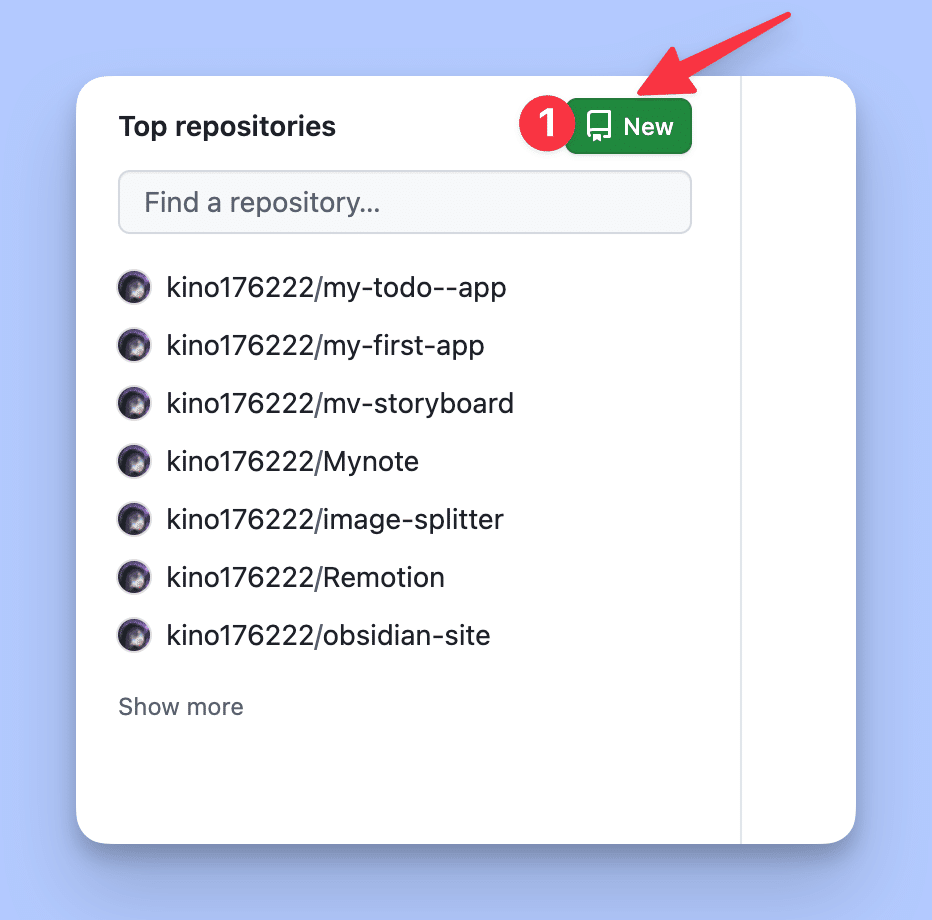

作成していきます。「New」をクリック。


名前は、プロジェクト名またはAntigravityのおすすめでOK


URLをAntigravityに教えてあげましょう


プッシュしてくれます


プッシュ完了しました


履歴画面です。この状態にいつでも戻ることができます！

  
このように、あなたのコードは  
👉 **PCが壊れても消えない状態** 👉**いつでも戻せる状態**にできます。  
必ずマスターしましょう！

  

  

  

  

  

### ✅ 記録フェーズ チェックリスト

🔲 GitHubのアカウントを作成できた  
🔲 自分のプロジェクト用リポジトリを作成できた  
🔲 コードをGitHubにプッシュ（保存）できた  
🔲 「プッシュ＝セーブ」だと体感で理解できた  
🔲 PCが壊れてもコードは残る状態になった

👉 ここまでチェックが付いたら、次の章へ進んでOKです。

  

  

  

  

  


## ：公開フェーズ（デプロイ）

  

### なぜ Vercel なのか


最後は、この保存したデータを**全世界に公開（デプロイ）**  します。  
本来、Webサイトの公開はかなり面倒でした。

- サーバーを契約して（月額〇〇円）

- ファイルをアップロードして

- 黒い画面で設定して…

正直、初心者が一人でやるにはハードルが高すぎます。  
ですが、現代には**その面倒をほぼ全部肩代わりしてくれる神サービス**  があります。  
それが  **「Vercel（バーセル）」**  です。

  

  

### GitHub と連携する意味

それは、GitHubと相性バツグンだから。

Vercelは、  **GitHubと連携することで初めて力を発揮**  します。

一度「このリポジトリを公開する」と設定すれば、  
その後は

GitHubにコードを保存（プッシュ）  
→「更新していいよ」とVercelが判断  
→自動で最新状態を公開  
という流れになります。

※ 最初の連携と公開操作は自分で行います  
※ 勝手に公開されるわけではないので安心してください**そして、完全無料（個人開発なら十分）**個人の学習・趣味・ポートフォリオ用途であれば、

- 無料プランでOK

- クレジットカード登録も不要

「とりあえず公開してみたい」人には、これ以上ない環境です。**とにかく速い** Vercelは、世界中にサーバーを持っています。  
そのため、

- 日本から見ても

- 海外から見ても

ページの表示がとても速いです。  
「遅くて開かない…」というストレスがほぼありません。 **役割を一言でまとめると** - **GitHub** → 倉庫（コードを安全に保管する場所・基本は非公開）

- **Vercel** → 展示場（世界中の人が見られるステージ）

GitHubにしまった作品を、  
Vercelが **「展示していい形」に整えて公開してくれる** ──そんなイメージです。

  

  
このあと実際に、

- Vercelのアカウントを作って

- GitHubとつなぎ

- AIに「デプロイして」と頼む

という流れをやっていきます。

「また英語が出てきそう…」と思っても大丈夫。  
ここも **AIに丸投げでOK**  です。

次は、いよいよ**あなたのアプリを世界に放つ瞬間**  です 🚀

  

  

### Vercelの登録

1. [ **Vercel公式サイト** ](https://vercel.com/) にアクセスし、「Sign Up」を押す。
2.  **「Hobby」**  プランを選択し、名前を入力。
3.  **「Continue with GitHub」**  を押して、さっき作ったGitHubアカウントと連携する。
	- これで登録完了です！

[ **Vercel: Build and deploy the best web experiences with the AI Cloud – Vercel**  *Vercel gives developers the frameworks, workflows, and infras* *vercel.com*](https://vercel.com/)

  

```ruby
作ったアプリを全世界に公開したいです。
Vercelのセットアップをフォローしてください。
```

※ここも英語の画面が出ますが、  **読む必要はありません。いつも通り、AIに聞きながら進めましょう。** ### 8.4 デプロイをAIに任せる

登録が済んだら、チャット欄でこう唱えてください。 **■ コピペ用プロンプト** > **「このプロジェクトを、Vercelを使ってデプロイ（公開）して。」** AIがいくつかの確認をしてくるかもしれません（ログイン認証など）。  
その都度、画面の指示に従ってポチポチ押していけばOKです。

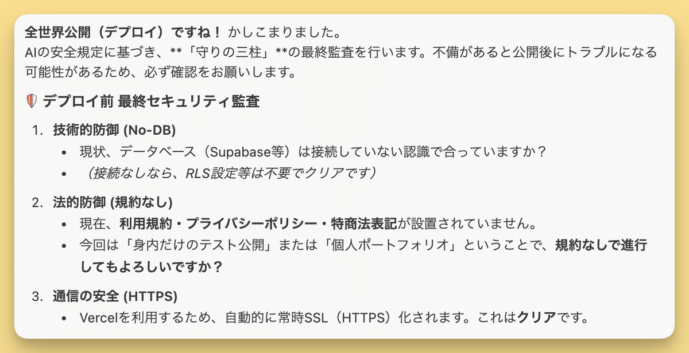

まず、GEMINI.mdに記載したルールにより、ヒアリングがあります


今回のWEBページは、利用規約とプライバシーポリシーは不要と判断しました

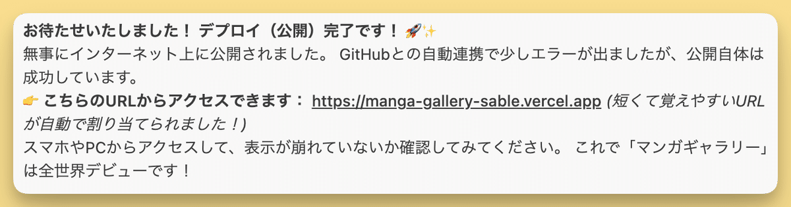

デプロイが完了すると、URLが表示されます

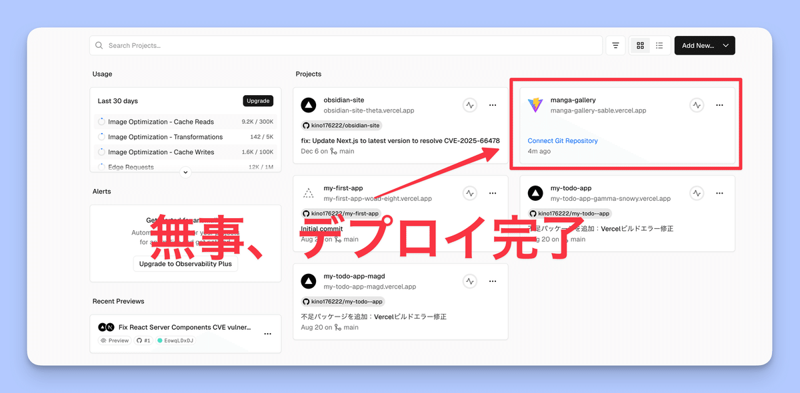

Vercelの画面

  

  

  

  

  

### 公開されたサイトを確認する

処理が終わると、\`https://...vercel.app\` という **「本物のURL」**  が発行されます。

[ **Manga Gallery**  *A stunning gallery of manga and artwork.**manga-gallery-sable.vercel.app*](https://manga-gallery-sable.vercel.app/?v=2)

[ **CYBER OMIKUJI 2077**  *未来のおみくじにアクセスせよ。Hack your destiny.**omikuji-app-theta.vercel.app*](https://omikuji-app-theta.vercel.app/?v=new1)

それをスマホで開いてみてください。動いていますか？  
…おめでとうございます！！**あなたが作ったアプリが、今、インターネットの海に産声を上げました。** そのURLを友だちにLINEで送りつけましょう。  
「これ、俺がAIで作ったんだぜ」と。

  

  

  

  

  

### ✅ 公開フェーズ チェックリスト

🔲 Vercelにログインできた  
🔲 自分のプロジェクトがVercelに連携されていることを確認した  
🔲 発行された公開URLにアクセスした  
🔲 スマホや別ブラウザからも表示できることを確認した

👉 ここまでチェックが付いたら、次の章へ進んでOKです。

  

  

  

  


## 【Q&A】よくある質問コーナー

初心者の皆さんが抱きがちな質問に、先にお答えしておきます。  

Q. 本当に完全無料ですか？ A. はい、現時点では完全無料です。 Antigravity自体も無料ですし、内蔵されているAI（Gemini）の使用料もかかりません。クレジットカードの登録も不要です。

Q. 低スペックなPCでも大丈夫？ A. ブラウザが快適に動くなら大丈夫です。 Antigravityは非常に軽量なアプリなので、最新のゲーミングPCなどは必要ありません。普通のノートPC（MacBook Airなど）でサクサク動きます。

Q. スマホやiPadでもできますか？ A. 閲覧はできますが、開発はPC推奨です。 コードを書いたり、細かい設定をするのは、現時点ではPC（キーボードとマウス）があった方が圧倒的に楽です。

Q. 英語が全く読めませんが平気ですか？ A. スクショ翻訳があるので平気です。 Antigravityの画面は英語の部分もありますが、STEP 1で日本語化できますし、わからないメッセージはスクショしてAIに投げれば全部翻訳・解説してくれます。

Q. 作ったアプリはスマホで見れますか？ A. はい！ STEP 5で「Vercel」にデプロイすれば、発行されたURLをスマホに送るだけで、自分のスマホで動かせます。家宝になりますよ。

  

  

  

  

  


## ：おわりに（冒険の続き）

お疲れ様でした！  
ここまで走り抜けたあなたは、もう「初心者」ではありません。  
最強の相棒（AI）と、最強の武器（環境）を手に入れた、 **一人前の「Vibe Coder」です。** ### 10.1 0地点の再確認

冒頭で話した **「プログラミングの0地点」**  。  
その意味が、今は体感できているはずです。

- エラーが出ても、スクショすればいい。

- やり方が分からなくても、チャットで聞けばいい。

-  **「何が起きても、自分一人で解決して前に進める」** この状態こそが「0地点」であり、同時に **「最強のスタートライン」**  です。  
このスタートラインに立ったあなたに、もはや作れないものはありません。

  

  

  

  

  

### 次のミッション

ここから先は、教科書をなぞるのではなく、  **「自分の悩み」**  を解決する旅に出てください。

私が作った「画像9分割アプリ」もそうでした。  
「スマホで画像をちまちま加工するの、マジで面倒くさい…」  
その怒りをAIにぶつけたら、1時間でアプリになり、世界中の人が使ってくれるツールになりました。

あなたの日常にも  **「これ面倒だな」**  が隠れているはずです。  
それをAIに愚痴ってください。それがあなたの次回作になります。

  

  

  

  

  

### コメント欄の使い方

もし途中でつまずいたり、エラーが解決できなかったら？  
本書の  **コメント欄**  をサポートセンターとして使ってください。

- 「STEP 2のここで変なエラーが出ました！」

- 「用語の意味がわかりません！」

私が全力で回答しますし、他の親切なVibe Coderたちが助けてくれるかもしれません。  
また、  **アプリが完成したら、ぜひURLを貼って自慢してください！**  みんなで「いいね」しに行きます。

もし、本書が参考になったら評価で応援、友人にシェアしていただけると大変はげみになります。

  

では今日はここまで。  
最後まで読んでいただき、ありがとうございました。


【完全無料】初心者向けVibe Coding入門：AIと対話してアプリを作る→Gitで保存→世界に公開｜Kino